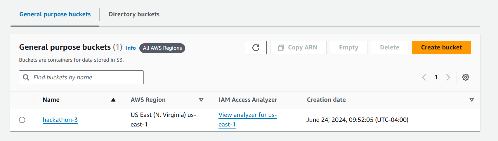
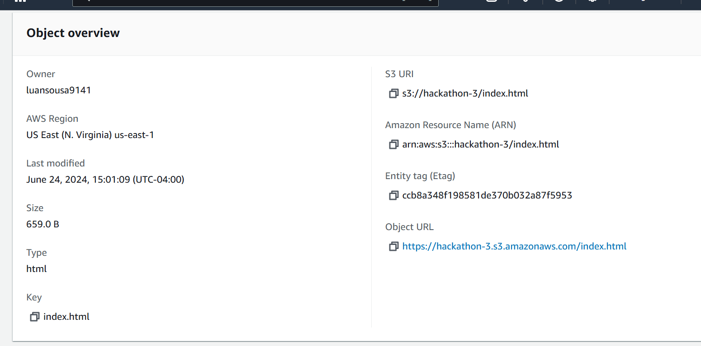
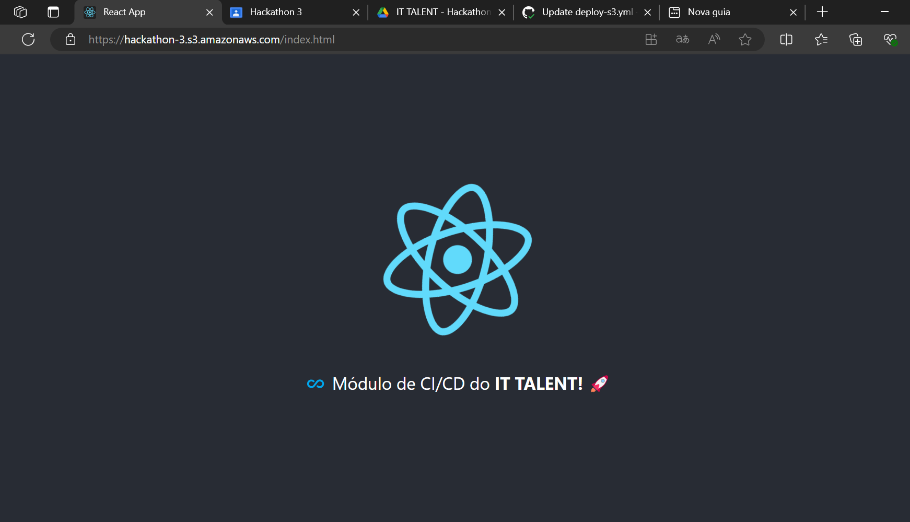

# React app no bucket s3

 - Membro: Marcos Luan de Sousa Damasceno
 - Link:https://hackathon-3.s3.amazonaws.com/index.html 

## Prints

 - ID do recurso do seu S3
    
    
    

 - link público com o build
    